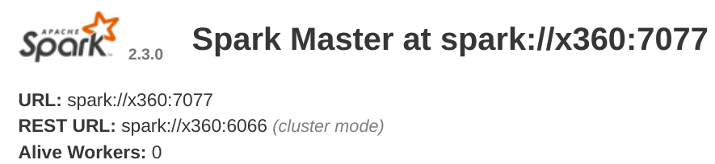
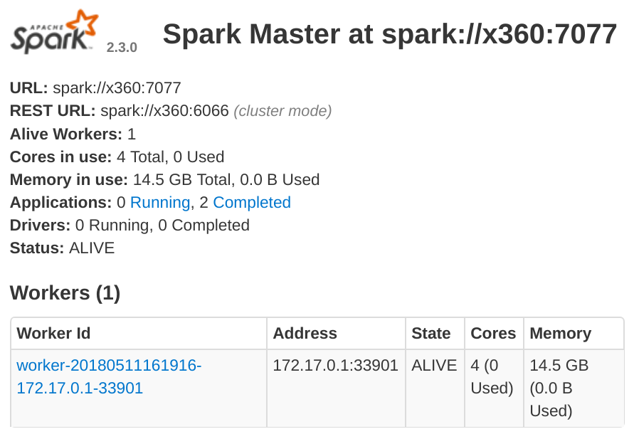

= Processing Wikipedia with Spark
Siddhesh Rane
2018-05-10 02:09
:jbake-type: post
:jbake-status: published
:jbake-tags: spark, semantic web, nlp
:jbake-coverimage: processing-wikipedia-with-spark/spark-bulb.jpg
:jbake-description: What Beginners Wished They Knew 
:icons: font
:imagesdir: .

For my Btech project I had to process all articles in Wikipedia. The uncompressed dump of its plaintext is 14GB in size, which doesn't sound like much until
you run even a trivial word count pipeline on it. I had to do more than that, think matching 100 million labels over all the articles. It was no task for 
a single machine, so I used http://spark.apache.org[Spark] to distribute the load over a cluster of machines. In this post I'll list everything that I wish 
I didn't have to discover on my own.

== Spark: Dos and Don'ts

This guide assumes you have a general idea about Spark and its terminology but haven't tried it out yet.
I used Spark 2.3.0 with Dataframe based ML API.
Entire cluster was self-provisioned on commodity hardware, not using cloud infrastructure.

CAUTION: As of this writing I am still new to Spark so the problems are fresh in my mind and I can perhaps relate to beginners better.
	     I have written tips which are guaranteed to work from my personal experience, but do not religiously rely on my explanations. 
	     Some of them are mere inferences and rest are StackOverflow.

TIP: Tips are written in these boxes. They form the *TL;DR* version of the post.

=== Download and Setup

If you set out to download Spark, you'll notice that there are various binaries available for the same version.
Spark advertizes that it does not need hadoop so you might download the user-provided-hadoop version which is smaller in size. 
Don't do that. 

TIP: Download the Spark binary that comes with packaged hadoop dependencies

Although Spark does not use Hadoop's MapReduce framework, it does have dependencies on other Hadoop libraries like HDFS and YARN.
The without-hadoop version is when you already have hadoop libraries provided elsewhere

Once you test the built in examples on `local` cluster, and ensure that everything is installed and working properly, proceed to set up your cluster.
Spark gives you 3 options: Mesos, YARN and Stand-alone. The first two are resource allocators which control your slave nodes and Spark has to request them 
to allocate its own instances. As a beginner don't increase your complexity by going that way.

TIP: Use the stand-alone cluster mode, not Mesos or YARN

The stand-alone cluster is the easiest to setup and comes with sensible defaults, like using all your cores for executors.
It is part of the spark distribution itself and has `sbin/start-all.sh` script that can bring up the master as well as all 
your slaves listed in `conf/slaves` using ssh. Mesos/YARN are separate programs that are used when your cluster isn't just a spark cluster.
Also, they don't come with sensible defaults: executors don't use all cores on the slaves unless explicitly specified.

You also have the option of a high availability mode using Zookeeper, which keeps a list of backup masters incase any master fails.
Since you are a beginner you are likely not handling a 1000 node cluster where the risk of node failure is significant.
You are more likely to set up a cluster on a managed cloud platform like Amazon's or Google's, which already take care of node failures.

TIP: You don't need high availability with cloud infrastructure or a small cluster

I had my cluster set up in a hostile environment where human factors were responsible for power failures, and nodes going off the grid.
(Basically my college computer lab where diligent students turn off the machine and careless students pull out LAN cables). I could still pull off 
without high availability by careful choice of the master node. You wouldn't have to worry about that.

One very important aspect is the Java version you use to run Spark. 
Normally a higher version of Java works with something compiled for older releases
but with Project Jigsaw, modularity introduced stricter isolation and boundaries in Java 9 which breaks certain things that use reflection.
On Spark 2.3.0 running on Java 9, I got illegal reflection access. Java 8 had no issues.

TIP: Check the Java version you use to run Spark. Spark 2.3.0 works with Java 8 but gives illegal access errors on Java 9

This will definitely change in the near future but keep that in mind till then.

The stand-alone cluster is very sensitive about URLs used to resolve master and slave nodes. Suppose you start the master node like below

[source, shell]
----
siddhesh@x360:/opt/spark-2.3.0-bin-hadoop2.7$ sbin/start-master.sh
----

and your master is up at `localhost:8080`

By default, your PC's hostname is chosen as the master URL address.
`x360` resolves to `localhost` but starting a slave like below will *not work*

[source, shell]
----
# does not work
siddhesh@x360:~/opt/spark-2.3.0-bin-hadoop2.7$ sbin/start-slave.sh spark://localhost:7077
----

TIP: Specify the master URL exactly as is. Do not resolve domain names to IP adresses or vice-versa

[source, shell]
----
# works
siddhesh@x360:~/opt/spark-2.3.0-bin-hadoop2.7$ sbin/start-slave.sh spark://x360:7077
----

This works and our slave has been added to the cluster

Our slave has IP address in the 172.17.x.x subdomain which is actually the subdomain set up by docker on my machine.
The master can communicate with this slave because both are on the same machine, but the slave cannot communicate with other slaves
on the network or a master on a different machine, because its IP address is not routable.
Like in the master case above, a slave on a machine without master will take up the hostname of the machine.
When you have identical machines all of them end up using the same hostname as their address.
This creates a total mess and no one can communicate with the other.

TIP: Explicitly control the IP addresses taken by master and slaves using `-h` option in start scripts or `SPARK_LOCAL_IP` environment variable.

So the above commands would change to

[source, shell]
----
# start master
siddhesh@master:~/opt/spark-2.3.0-bin-hadoop2.7$ sbin/start-master.sh -h $myIP
# start slave
siddhesh@slave:~/opt/spark-2.3.0-bin-hadoop2.7$ sbin/start-slave.sh -h $myIP spark://<masterIP>:7077
# submit a job
siddhesh@driver:~/opt/spark-2.3.0-bin-hadoop2.7$ SPARK_LOCAL_IP=$myIP bin/spark-submit ...
----

where `myIP` is the IP address of the machine which is routable between the cluster nodes.
It is more likely that all nodes are on the same network so you can write a script which will set `myIP` on each machine.

[source, shell]
----
# assume all nodes in the 10.1.26.x subdomain
siddhesh@master:~$ myIP=`hostname -I | tr " " "\n" | grep 10.1.26. | head`
----

=== Flow of the Code

So far we have set up our cluster and see that it is functional. Now its time to code. Spark is quite well documented and comes with
lots of examples so its very easy to get started with coding. What is less obvious is how the whole thing works which results in some very
hard to debug errors during runtime. Suppose you coded something like this

[source, java]
----
class SomeClass {
static SparkSession spark;
static LongAccumulator numSentences;

    public static void main(String[] args) {
             spark = SparkSession.builder()
                     .appName("Sparkl")
                     .getOrCreate(); // <1>
      numSentences = spark.sparkContext().longAccumulator("sentences"); // <2>
      spark.read().textFile(args[0]).foreach(SomeClass::countSentences) // <3>
    }
    static void countSentences(String s) { numSentences.add(1); } // <4>
}
----
<1> create a spark session
<2> create a long counter to keep track of job progress
<3> traverse a file line by line calling countSentences for each line
<4> add 1 to the accumulator for each sentence

The above code works on a `local` cluster but will fail with a null pointer exception when run on a multinode cluster.
Both `spark` as well as `numSentences` will be null on the slave machine.
To solve this problem

TIP: Encapsulate all initialized state in non-static fields of an object. Use `main` to create the object and defer further processing to it.

What you need to understand is that the code you write is run by the driver node exactly as is, but what the slave nodes execute is 
a serialized job that spark gives them. Your classes will be loaded by the JVM on the slave and static initializers will run as expected
but functions like `main` won't so static values initialized in the driver won't be seen in the slave.
I am not sure how the whole thing works and am only inferring from experience so take my explanation with a grain of salt.
So your code now looks like

[source, java]
----
class SomeClass {
SparkSession spark; // <1>
LongAccumulator numSentences;
String[] args;
    
    SomeClass(String[] args) { this.args = args; }
    
    public static void main(String[] args){
        new SomeClass(args).process(); // <2>       
    }
    
    void process() {
        spark = SparkSession.builder()
                .appName("Sparkl")
                .getOrCreate();
      numSentences = spark.sparkContext().longAccumulator("sentences");
      spark.read().textFile(args[0]).foreach(this::countSentences); // <3>
    }
    void countSentences(String s) { numSentences.add(1); }
}
----
<1> Make fields non static
<2> create instance of the class and then execute spark jobs
<3> reference to `this` in the foreach lambda brings the object in the closure of accessible objects and thus gets serialized and sent to all slaves

Those of you who are programming in Scala might use Scala ``object``s which are singleton classes and hence may never come across this problem. Nevertheless,
it is something you should know.

=== Submit App and Dependencies

There is more to coding above but before that you need to submit your application to the cluster. Unless your app is extremely trivial, chances are you are using
external libraries. When you submit your app jar you also need to tell Spark the dependent libraries that you are using, so it will make them available on all nodes.
It is pretty straightforward. The syntax is 

	bin/spark-submit --packages org.apache.opennlp:opennlp-tools:1.8.4,groupId:artifactId:version, ...

I have had no issues with this scheme. It works flawlessly. 
I generally develop on my laptop and then submit jobs from a node on the cluster. So I need to transfer the app and its dependencies to
whatever node I ssh into. Spark looks for dependencies in the local maven repo, then the central repo and any repos you specify using `--repositories` option.
It is a little cumbersome to sync all that on the driver and then type out all those dependencies on the command line. So I prefer all dependencies packaged in a 
single jar, called an uber jar.

TIP: Use Maven shade plugin to generate an uber jar with all dependencies so job submitting becomes easier

Just include the following lines in your `pom.xml`

[source, xml]
----
<build>
  <plugins>
    <plugin>
      <groupId>org.apache.maven.plugins</groupId>
      <artifactId>maven-shade-plugin</artifactId>
      <version>3.0.0</version>
      <configuration>
        <artifactSet>
          <excludes>
            <exclude>org.apache.spark:*</exclude>
          </excludes>
        </artifactSet>
      </configuration>
      <executions>
        <execution>
          <phase>package</phase>
          <goals>
            <goal>shade</goal>
          </goals>
        </execution>
      </executions>
    </plugin>
  </plugins>
</build>
---- 

When you build and package your project, the default distribution jar will have all dependencies included.

As you submit jobs the application jars get accumulated in the `work` directory and fill up over time. 

TIP: Set `spark.worker.cleanup.enabled` to true in `conf/spark-defaults.conf`

This option is false by default and is applicable to the stand-alone mode.

=== Input and Output files

This was the most confusing part that was difficult to diagnose.

Spark supports reading/writing of various sources such as `hdfs`, `ftp`, `jdbc` or local files on the system when the protocol is `file://` or missing.
My first attempt was to read from a file on my driver. I assumed that the driver would read the file, turn it into partitions and then distribute those
across the cluster. Turns out it doesn't work that way.

TIP: When you `read` a file from the local filesystem, ensure that the file is present on all the worker nodes at exactly the same location.
     Spark does not implicitly distribute files from the driver to the workers.

So I had to copy the file to every worker at the same location. The location of the file was passed as an argument to my app. Since the file was located 
in the parent folder I specified its path as `../wikiArticles.txt`. This did not work on the worker nodes.

TIP: Always pass absolute file paths for reading

It could be a mistake from my side but I know that the file path made it as is into the `textFile` function and it caused file not found errors.

Spark supports common compression schemes so most gzipped or bzipped text files will be uncompressed before use. It might seem that compressed files
will be more efficient but do not fall for that trap.

TIP: Don't read from compressed text files, especially `gzip`. Uncompressed files are faster to process

Gzip cannot be uncompressed in parallel like bzip2, so nodes spend the bulk of their time uncompressing large files.

It is a hassle to make the input files available on all workers. You can instead use Spark's file broadcast mechanism.
When submitting a job specify a comma separated list of input files with the `--files` option. Accessing these files requires `SparkFiles.get(filename)`.
I could not find enough documentation on this feature.

TIP: To read a file broadcasted with the `--files` option use `SparkFiles.get(<onlyFileNameNotFullPath>)` as the pathname in read functions.

So a file submitted as `--files /opt/data/wikiAbstracts.txt` would be accesed as `SparkFiles.get("WikiAbstracts.txt")`. This returns a string which you can use 
in any read function that expects a path. Again, remember to specify absolute paths.

Since my input file was 5GB gzipped, and my network was quite slow at 12MB/s I tried to use Spark's file broadcast feature but the decompression itself was taking so long that I manually copied the file to every worker. If your network is fast enough you can use uncompressed files. Or alternatively use HDFS or FTP server.

Writing files also follows the semantics of reading. I was saving my DataFrame to a csv file on the local system. Again I had the assumption that the results will
be sent back to the driver node. Didn't work for me. 

TIP: When a DataFrame is saved to local file path each worker saves its computed partitions to its own disk. No data is sent back to the driver

I was only getting a fraction of the results I was expecting. Initially I had misdiagnosed this problem as an error in my code. Later I found out that each worker
was storing its computed results on its own disk.

=== Partitions

The number of partitions you make affects the performance. By default Spark will make as many partitions as there are cores in the cluster.
This is not always optimal.

TIP: Keep an eye on how many workers are actively processing tasks. If too few, increase the number of partitions.

If you read from a gzipped file Spark creates just one partition which will be processed by only one worker.
That is also one reason why gzipped files are slow to process.
I have observed slower performance with small number of large partitions as compared to large number of small partitions.

TIP: Its better to explicitly set the number of partitions while reading data.

You may not have to do this when reading from HDFS as Hadoop files are already partitioned.

== Wikipedia and DBpedia

There is not much to write in this section as it was pretty straight forward. It is meant to make you aware of alternatives.
The entire Wikipedia xml dump is 14GB compressed and 65 GB uncompressed. Most of the times you only want the plain text of the article but the dump
is in MediaWiki markup so it needs some preprocessing. There are many tools available for this in various languages. Although I haven't used them personally
I am pretty sure it must be a time consuming task. But there are alternatives

TIP: If all you want is the Wikipedia article plaintext, mostly for NLP, then download the dataset made available by DBpedia. 

I used the full article dump (`NIF Context`) available at http://wiki.dbpedia.org/downloads-2016-10 (direct download from http://downloads.dbpedia.org/2016-10/core-i18n/en/nif_context_en.ttl.bz2[here]). This dataset gets rid off unwanted stuff like tables, infoboxes and references. The compressed download is 4.3GB in the `turtle`
format. You can covert it to tsv like so

	# bzcat nif-context.ttl.bz2 | grep 'nif-core#isString' | sed 's/?dbpv=2016-10&nif=context//' | awk '{$1=$1"\t"; $2=""; print }' > url-article.tsv

Similar datasets are available for other properties like page links, anchor texts and so. Do check out https://dbpedia.org[DBpedia].

== A word about Databases

I never quite understood why there is a plethora of databases, all so similar, and on top of that people buy database licenses.
Until this project I hadn't seriously used any. I ever only used MySQL and Apache Derby.
For my project I used a SPARQL triple store database, Apache Jena TDB accessed over a REST API served by Jena Fuseki.
This database would give me RDF urls, labels and predicates for all the resources mentioned in the supplied article.
Every node would make a database call and only then would proceed with further processing.

My workload had become IO bound as I could see near 0% CPU utilization on worker nodes.
Each partition of the data would result in two SPARQL queries. In the worst case scenario, one of the two queries was taking 500-1000 seconds to process.
Thankfully, the TDB database relies on linux's memory mapping. I could map the whole DB into RAM and significantly improve performance.

TIP: If you are IO bound and your database can fit into RAM, better run it in memory.

I found a tool called https://hoytech.com/vmtouch/[vmtouch] which would show what percentage of the database directory had been mapped into memory. 
This tool also allows you to explicitly map any files/directories into the RAM and optionally lock it so it wont get paged out.
My 16GB database could easily fit into my 32 GB RAM server. This boosted query performance by orders of magnitude to 1-2 seconds per query.
Using a rudimentary form of database load balancing based on partition number, I could cut down my execution time to half by using 2 SPARQL servers
instead of one.

== Conclusion

I truly enjoyed distributed computing on Spark. Without it I could not have completed my project. 
It was quite easy to take my existing app and have it run on Spark.
I definitely would recommend anyone to give it a try.
